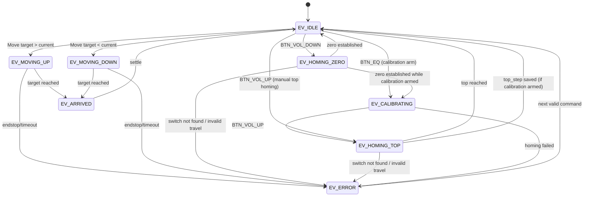

# SceneStateController – Scene / State Design

Scene and State are separated layers.
- **Scene**: meaning/presentation layer for LED + upper-level behavior.
- **Elevator State**: mechanical state for stepper motion, homing, and calibration.

## Elevator control model (2026-04 update)

### Position model
- Bottom endstop (`ENDSTOP_DOWN`) is treated as **absolute zero**.
- Top range limit is stored as `top_step` in NVS (`Preferences`, namespace `ev_calib`).
- Normal runtime target is clamped to `0..top_step` when calibration exists.

This design intentionally fixes `min=0`, so only `top_step` is persisted.

### IR control mapping
- `BTN_EQ`      : Start calibration flow (immediately runs zero homing).
- `BTN_VOL_DOWN`: Zero homing only.
- `BTN_VOL_UP`  : Top homing. If calibration is armed, captures `top_step` and saves it.
- `BTN_0..BTN_3`: Direct move to floor index (`0..3`).
- `BTN_PREV/NEXT`: Manual CW/CCW spin while held.

## Elevator state transition diagram

## Calibration procedure
1. Press **EQ** to arm calibration and run zero homing.
2. After zero is established, press **VOL_UP**.
3. On top endstop detect, current position is captured as `top_step` and saved via Preferences.
4. Normal move commands then run in the calibrated `0..top_step` range.

## Failure policy
- Homing phases use max travel guard; if exceeded, state transitions to `EV_ERROR`.
- Endstop conflict during regular position move transitions to `EV_ERROR`.
- Calibration flag is cleared after top capture/save.
